# Tollgate — 多租户 LLM API Gateway(简历素材 · 中文版)

> 项目类型判断:**A 类「后端 / 全栈系统」**。
> 判断依据:核心是 Spring Boot + PostgreSQL 实现的多租户网关 —— 围绕 API key 鉴权、按 `SELECT … FOR UPDATE` 的事务化配额扣减、计费/审计/对账 SQL 报表展开;LLM 调用本身被显式 mock(`GatewayService.java` 中 `outputTokens` 与 `latencyMs` 是 `ThreadLocalRandom`,响应文案是 `"Mock LLM response generated"`),不存在 agent loop、tool calling、RAG、provider SDK 这类 B 类要素。前端是一个用 fetch 直接调后端 REST 的 React Dashboard,不构成额外类型。

---

## 项目描述(2-3 句)

Tollgate 是一个多租户 LLM API 网关:任何客户端发来的 LLM 调用都通过单一 `/api/gateway/submit` 入口,网关在一次事务里完成「按 SHA-256 哈希查 key → 检查租户/key/模型状态 → 对 `monthly_quota` 行加悲观锁扣 token → 写 `request`/`response`/`denied_event`/`audit_log`」。配套提供管理(tenant/project/key/model/pricing/quota CRUD)、月度 invoice 生成、以及成本/模型表现/配额告警/合规审计的分析 SQL 接口,前端是 React + Vite Dashboard 直接消费这些 REST API。

## 架构图

```mermaid
flowchart TD
    Client[HTTP Client / curl / SDK]
    Dashboard[React 18 + Vite Dashboard]

    subgraph Backend[Spring Boot 3.2.4 - Java 17]
        GW[GatewayController POST /api/gateway/submit]
        AdminC[AdminController /api/tenants /api/projects /api/keys /api/models /api/pricing /api/quotas]
        ReportC[ReportController /api/reports/*]
        AuditC[AuditController /api/audit/*]
        InvoiceC[InvoiceController /api/invoices]

        GWSvc[GatewayService Transactional]
        AdminSvc[AdminService Transactional]
        ReportSvc[ReportService]
        AuditSvc[AuditService]
        InvoiceSvc[InvoiceService Transactional]
        DemoInit[DemoKeyInitializer ApplicationRunner]
        HashUtils[HashUtils SHA-256]
    end

    subgraph DB[PostgreSQL 15 on GCP Compute Engine]
        Tenant[(tenant)]
        Project[(project)]
        ApiKey[(api_key)]
        Model[(llm_model)]
        Pricing[(model_pricing)]
        Request[(request)]
        Response[(response)]
        Denied[(denied_event)]
        Quota[(monthly_quota)]
        Invoice[(invoice)]
        AuditLog[(audit_log)]
    end

    Dashboard -- fetch JSON --> GW
    Dashboard -- fetch JSON --> AdminC
    Dashboard -- fetch JSON --> ReportC
    Dashboard -- fetch JSON --> AuditC
    Dashboard -- fetch JSON --> InvoiceC
    Client -- X-API-Key + JSON --> GW

    GW --> GWSvc
    AdminC --> AdminSvc
    ReportC --> ReportSvc
    AuditC --> AuditSvc
    InvoiceC --> InvoiceSvc

    GWSvc --> HashUtils
    GWSvc -- key_hash lookup --> ApiKey
    GWSvc --> Model
    GWSvc --> Pricing
    GWSvc -- SELECT FOR UPDATE --> Quota
    GWSvc -- insert/update --> Request
    GWSvc --> Response
    GWSvc --> Denied
    GWSvc --> AuditLog

    AdminSvc --> Tenant
    AdminSvc --> Project
    AdminSvc --> ApiKey
    AdminSvc --> Model
    AdminSvc --> Pricing
    AdminSvc --> Quota

    ReportSvc -- native SQL --> Request
    ReportSvc -- native SQL --> Response
    ReportSvc -- native SQL --> Quota

    AuditSvc -- native SQL --> Request
    AuditSvc -- native SQL --> Response
    AuditSvc -- native SQL --> ApiKey

    InvoiceSvc -- aggregate --> Request
    InvoiceSvc -- aggregate --> Response
    InvoiceSvc --> Invoice

    DemoInit --> ApiKey

    GAE[GCP App Engine Standard Java 17] --- Backend
    GAE -- jdbc:postgresql --> DB
```

## Domain Knowledge(业务领域 + 请求生命周期)

- **业务领域**:面向「同一家公司内多团队共享 LLM 调用」的网关。核心抽象层级是 `tenant → project → api_key → request`(`schema.sql`)。billing month 用 `CHAR(7)` 字符串(`YYYY-MM`),quota 与 pricing 都以 `(project_id, billing_month)` / `(model_id, billing_month)` 为唯一键(`schema.sql`)。
- **一次 `/api/gateway/submit` 的真实生命周期**(`GatewayService.submitRequest`,单个 `@Transactional`):
  1. 校验 `X-API-Key`、`modelId`、`inputTokens` 非空且为正(`ValidationUtils`);
  2. `HashUtils.sha256Hex` 计算 key_hash,`apiKeyRepository.findByKeyHash` 查 key,未命中直接 401;
  3. 若 `apiKey.status == "revoked"`:写一条 `status=denied` 的 `request`、`denied_event(reason=KEY_REVOKED)`、`audit_log`,返回 403;
  4. 若客户端带了 `idempotencyKey` 且命中已存在的 `(project_id, idempotency_key)`:直接走 `buildIdempotentResult` 重放历史结果(`response.idempotent = true`);
  5. 若 `tenant.status == "suspended"`:denied + 403;若 `model.is_active == false`:denied + 400;
  6. 用 `MonthlyQuotaRepository.findForUpdate`(`@Lock(PESSIMISTIC_WRITE)`) 锁住当月 quota 行,缺失 quota 或 pricing 直接报错;
  7. 若 prompt 包含 `__fail__` 触发字串:走 `buildFailedResult`,写 `status=failed` 与 `error_type=LLM_SERVICE_ERROR` 的 response,返回 502(用于演示失败链路);
  8. 否则 mock 一个 `outputTokens ∈ [50,500]`、`latencyMs ∈ [200,3000]`,按 `(input_rate * input_tokens + output_rate * output_tokens) / 1000` 算 `computed_cost`;若 `tokens_used + input_tokens > token_limit` → denied + 429(同时把 `threshold_pct = tokens_used * 100 / token_limit` 写进 `denied_event`);
  9. 通过校验则更新 `quota.tokens_used`,写 success `request` + `response` + `audit_log(REQUEST_ACCEPTED)`,返回 200。
- **附带的分析视角**(`ReportService` + `AuditService`):
  - 项目最近 N 天的成本 / 总 token(原生 SQL,`days * INTERVAL '1 day'`);
  - 某 tenant 本月 Top 5 项目成本;
  - 按 model 聚合成功率、平均延迟、总请求数;
  - 当月 quota 使用率 > 80% 的项目告警;
  - 指定 api_key 的请求清单(可按时间段过滤);
  - 「revoked 之后还产生过请求」的合规扫描;
  - 缺失 `response` 的 `request` 异常清单。
- **计费**(`InvoiceService.generateInvoices`):对每个 project 跑 `getInvoiceAggregate` 聚合该月 `request + response`,upsert 一条 `(project_id, billing_month)` 唯一的 invoice。

## 项目架构

### a. 整体架构
- 单体后端 + 单页前端,均部署在一处。
- 后端:Spring Boot 3.2.4,Java 17,Spring Web、Spring Data JPA、PostgreSQL driver(`pom.xml`)。
- 前端:React 18.3.1 + Vite 5.4 + framer-motion + lucide-react + recharts(`dashboard/package.json`)。打包后的静态文件被 `WebConfig` 直接挂到 Spring 的 `/**` 上(`addResourceLocations("classpath:/static/")`),实现「同一个 jar 同时提供 API 与前端」。
- 数据库:PostgreSQL 15(`docker-compose.yml` 与 README 中均明确)。

### b. 服务间通信
- 对外:REST/JSON。Gateway 入口走 `X-API-Key` header(`GatewayController`),其它管理类接口直接走路径/查询参数。
- 内部:无微服务拆分,Service 之间是普通 Spring bean 注入。
- CORS:`CorsConfig` 对 `/api/**` 开启全 origin pattern、`GET/POST/PUT/PATCH/DELETE/OPTIONS`、`maxAge=3600`、不带凭证。

### c. 数据访问层
- ORM:Spring Data JPA + Hibernate(`spring.jpa.database-platform=org.hibernate.dialect.PostgreSQLDialect`)。
- 11 张表(`schema.sql`):`tenant / project / api_key / llm_model / model_pricing / request / response / denied_event / monthly_quota / invoice / audit_log`,DDL 在 resources 中由 Spring 的 `spring.sql.init.mode=always` 启动时执行;`spring.jpa.hibernate.ddl-auto=none` 保证 Hibernate 不会反向干涉 schema。
- 查询风格混合:
  - 简单 CRUD 与按外键聚合用 Spring Data 派生方法(如 `findByProjectProjectIdAndIdempotencyKey`、`findByProjectProjectIdOrderByBillingMonthDesc`);
  - 报表/审计/计费用 `@Query(nativeQuery = true)` 原生 SQL + Spring Data **interface projection**(`ProjectCostProjection`、`ModelStatsProjection`、`QuotaAlertProjection` 等 8 个 projection 接口),避免把整张表反序列化进 entity;
  - 并发关键路径(`MonthlyQuotaRepository.findForUpdate`)用 `@Lock(LockModeType.PESSIMISTIC_WRITE)` 触发 `SELECT … FOR UPDATE`。
- 索引:`request` 表上为 `requested_at / project_id / key_id / model_id` 各建独立索引;`denied_event(denied_at)`、`api_key(status)` 也有索引(`schema.sql` 末尾)。
- 连接池:沿用 Spring Boot starter 默认(HikariCP,未在 `application.properties` 中显式调参)。
- 缓存:无应用层缓存。

### d. 安全(认证 / 授权)
- API key 仅以 **SHA-256 hex hash** 入库(`HashUtils.sha256Hex` + `api_key.key_hash UNIQUE`),原始 key 仅在 `POST /api/keys` 发放时返回一次(`ApiKeyResponse.rawKey`),后续都依赖 hash lookup。
- 撤销是软删除:`PATCH /api/keys/{keyId}/revoke` 把 `status='revoked'` + `revoked_at = now()`,记录保留以便后续审计扫描(`findRevokedKeyUsage` 查询「revoked 之后又收到的请求」)。
- 管理类接口(`AdminController`/`InvoiceController`)目前**没有鉴权层**(无 Spring Security、无 token 校验)。
- CORS 用 `allowedOriginPatterns("*")` + `allowCredentials(false)`(`CorsConfig`)。

### e. 事务 / 一致性 / 幂等
- 整条 `submitRequest` 是单个 `@Transactional`,涉及到的所有写(`request / response / denied_event / audit_log / monthly_quota`)在同一事务里成功或回滚。
- 配额扣减用悲观行锁(`SELECT … FOR UPDATE`,`MonthlyQuotaRepository.findForUpdate`),解决并发请求同时打爆同一 `(project_id, billing_month)` quota 的问题。
- 幂等:`request` 表 `UNIQUE (project_id, idempotency_key)`;`GatewayService` 在锁 quota 之前优先做幂等查询,命中直接重放历史响应,并把 `idempotent=true` 回填给客户端。
- denied/failed 分支也会写入完整的 `request` 行(`status` ∈ `success/failed/denied`),不让失败请求在审计中“消失”。

### f. 可观测性
- 业务侧自建审计表 `audit_log`(`AuditLog` entity,字段 `action / performed_by / details / logged_at`),`GatewayService` 在每个分支都会 `createAuditLog`(`REQUEST_ACCEPTED / REQUEST_FAILED / KEY_REVOKED / QUOTA_EXCEEDED / TENANT_SUSPENDED / MODEL_UNAVAILABLE`);`performed_by="gateway-service"`。
- 业务监控通过分析 SQL 接口暴露(成功率/平均延迟/缺失 response/越线 quota),前端 Dashboard 直接消费。
- Spring 默认 SQL 日志开启(`spring.jpa.show-sql=true`),便于本地排查。
- 未引入 Micrometer、Prometheus、链路追踪等额外组件。

### g. 部署
- 容器化:多阶段 `Dockerfile`(`maven:3.9.11-eclipse-temurin-17` 构建,`eclipse-temurin:17-jre` 运行,暴露 8080);`docker-compose.yml` 拉起 `postgres:15`(`tollgate-postgres`)+ `tollgate-app`,带 `pg_isready` healthcheck 与命名 volume `tollgate_pgdata`。
- 多种部署目标:
  - **GCP App Engine Standard(Java 17)** —— `app.yaml` 指定 `runtime: java17 / instance_class: F2`,通过 `appengine-maven-plugin` 的 `projectId=database-llm-gateway` 发布;README 给出 live URL `https://database-llm-gateway.uc.r.appspot.com`。
  - **Nixpacks**(`nixpacks.toml`)分两阶段:`cd dashboard && npm install && npm run build` 然后 `mvn clean package -DskipTests`,启动命令 `java -jar target/llm-api-gateway-0.0.1-SNAPSHOT.jar`。
  - **Procfile** 走 `web: java -jar target/...jar`(适配 Heroku 风格 PaaS)。
- 数据库托管:PostgreSQL 15 跑在 GCP Compute Engine VM 上(README 注明 e2-medium / us-central),App Engine 通过环境变量注入连接串。
- 无 CI/CD workflow 文件(仓库根没有 `.github/workflows/`)。

### h. 其他工程亮点
- **接口投影(Interface Projection)系统化使用**:8 个 `repository.projection.*` 接口,把 native SQL 结果安全映射成 DTO,避免 N+1 与多余字段。
- **DemoKeyInitializer**(`ApplicationRunner`):启动时会按配置(`DEMO_API_KEY` / `DEMO_API_KEY_PROJECT_NAME`)在指定 project 上 idempotent 地下发或复用一条 `demo-key`,并撤销 hash 不匹配的旧 demo key,使「拉一份就能跑通完整 demo」。
- **前后端同包发布**:`nixpacks.toml` 先 `vite build`,产物已经 commit 到 `src/main/resources/static`(`index-CPuWrJot.js` 等),`WebConfig.addViewControllers` 把非静态 path forward 到 `index.html`,这是 SPA + Spring Boot 的常见组合。
- **失败/成功路径形态对称**:`GatewayResult(httpStatus, body)` 统一封装,所有分支都返回 `GatewaySubmitResponse`(包含 `requestId / status / message / computedCost / outputTokens / latencyMs / httpStatus / errorType / deniedReason / idempotent / requestedAt`),前端不需要区别处理。
- **前端工程化**:`dashboard/src` 分 `pages/components/api/data` 四层,React 18 + framer-motion 做页面切换动画,recharts 画 model 表现 / quota donut;`api/client.js` 抽出 `apiFetch`,且每个调用都有 `.catch(() => MOCK)` fallback,后端挂掉时仍能展示 mock 数据。

---

## 简历可用 bullet 草稿(3-5 条)

- 设计并实现 Tollgate —— 一个 Java 17 / Spring Boot 3.2.4 多租户 LLM API 网关,围绕 11 张 PostgreSQL 表(`tenant/project/api_key/llm_model/model_pricing/request/response/denied_event/monthly_quota/invoice/audit_log`)建模租户隔离、配额、审计与计费全链路,在单一 `@Transactional` 入口完成鉴权 → 配额扣减 → 落库。
- 通过 `MonthlyQuotaRepository` 的 `@Lock(PESSIMISTIC_WRITE)` 触发 `SELECT … FOR UPDATE` 行锁,叠加 `(project_id, idempotency_key)` 唯一约束,实现并发请求下的原子 token 扣减与可重放幂等,denied/failed/idempotent-replay 共用统一 `GatewaySubmitResponse` 返回结构。[待确认: 是否做过并发压测,QPS / 锁等待时延数据]
- 使用 Spring Data Interface Projection + 8 段 native SQL 实现成本归因 / Top 5 项目 / 模型成功率与平均延迟 / Quota>80% 告警 / revoked-key 异常用量 / 缺失 response 异常等分析查询,直接为 React Dashboard 与月度发票生成提供数据底座。
- 用 SHA-256 哈希存储 API key(原始 key 仅签发时返回一次)+ 软删除式撤销(`status=revoked` + `revoked_at`)+ 启动时自愈的 `DemoKeyInitializer`,构建可审计的 key 生命周期,并通过 `audit_log` 把每次 allow/deny 决策与 `request_id` 关联。
- 多阶段 Docker 镜像 + `docker-compose`(Postgres 15 + 应用,带 healthcheck)+ GCP App Engine Standard(Java 17)/ Nixpacks 多目标部署,前端 React 18 + Vite 产物随 jar 一同发布,通过 `WebConfig` 将 SPA 路由 forward 到 `index.html`。[待确认: 线上是否仍在运行 / 是否有真实用户访问数据]

---

## ⚠️ 需我本人确认 / 补充的点

1. **是否真的跑过并发压测**:仓库里没有任何 JMeter / Gatling / k6 脚本,也没有性能报告。如果想在简历里写 QPS / 平均延迟 / 锁等待数据,需要你自己跑过实测并补数字。
2. **线上 URL 状态**:README 写 `https://database-llm-gateway.uc.r.appspot.com`,但仓库里没办法直接验证目前 GAE 是否还在运行、数据库 VM 是否还在跑。请确认。
3. **DB host 信息泄露**:`app.yaml` 里直接 commit 了一个公网 IP `35.238.165.15` 和明文密码 `yourpassword`,`.env`/`.env.example` 也有 demo 凭据 —— 简历不要写这些,同时建议你尽快把 `app.yaml` 改成 GCP Secret Manager 或环境变量替换。
4. **管理接口没有鉴权**:`/api/tenants`、`/api/projects`、`/api/keys`、`/api/quotas`、`/api/invoices/generate` 这些都没有任何身份校验(没用 Spring Security)。如果你和 mentor 说这是"生产级"网关会被追问 —— 建议要么主动承认"管理面 admin auth 还未实现,demo 用",要么补一个简单的 admin token check。
5. **真实流量规模**:仓库没有任何 token 量 / 请求量 / 租户数的真实指标。如果要写"支持 N 个租户 / 处理 M 次请求",请确认是否真有这些数字,否则改成"演示场景内造了 X 个 tenant / X 条 seed request"。
6. **`__fail__` 触发的失败链路是 demo 特性**:在 `GatewayService.containsFailureTrigger` 中,任何 prompt 含 `__fail__` 就会返回 502 + `error_type=LLM_SERVICE_ERROR`。这是面试可以讲的设计亮点("方便演示失败路径与审计写入"),但要明确说明不是生产功能。
7. **LLM 完全 mock**:`outputTokens` 和 `latencyMs` 都是 `ThreadLocalRandom`。如果对方误以为接了真实 OpenAI/Anthropic,请主动澄清"LLM 执行层故意 mock,项目重点在 schema 设计与事务正确性"(README 原话)。
8. **README 与代码的小矛盾**:README 提到「`request_id` 在 `response` 上 UNIQUE」与代码一致;但 README 提到"GCP firewall 限制只允许 App Engine 服务账号 IP",这一项无法从仓库代码确认,需要你自己核实。
9. **CI/CD**:仓库根没有 `.github/workflows/`,Bullet 里不要写"配 CI"。如果你有手动 mvn → appengine deploy 的脚本,记得自己描述清楚。
10. **个人贡献占比**:`README` 的 Team 部分(没读到全部)可能有合作者。请确认这个项目是个人独立完成还是团队作业,以及每个模块的具体负责人,简历里要写清"主导/合作完成"。
11. **数据库 schema 版本管理**:没有用 Flyway / Liquibase,而是直接 `schema.sql + data.sql`(`spring.sql.init.mode=always`)。这点要不要在简历上提"使用 Flyway"——目前不能写,因为代码里没有。
