# Tollgate — Multi-Tenant LLM API Gateway (Resume Material · English)

> **Project type classification: Type A "Backend / Full-Stack System".**
> Reasoning: the core of the repo is a Spring Boot + PostgreSQL multi-tenant gateway centered on API-key authentication, transactional quota enforcement via `SELECT … FOR UPDATE`, and billing / audit / reporting SQL. The LLM call itself is intentionally mocked (`GatewayService.java` derives `outputTokens` and `latencyMs` from `ThreadLocalRandom` and returns the literal string `"Mock LLM response generated"`). There is no agent loop, tool calling, RAG, or provider SDK — none of the markers of a Type B project. The React dashboard simply consumes the REST API via `fetch`, so it does not add another type either.

---

## Project Description (2–3 sentences)

Tollgate is a multi-tenant LLM API gateway. Every client LLM call goes through a single `/api/gateway/submit` entry point, where the gateway performs the full "look up the key by its SHA-256 hash → check tenant / key / model status → pessimistically lock the `monthly_quota` row and deduct tokens → persist `request` / `response` / `denied_event` / `audit_log`" sequence inside one database transaction. It ships with an admin surface (CRUD over tenant / project / key / model / pricing / quota), monthly invoice generation, and analytical SQL endpoints (cost attribution, model success rate, quota alerts, compliance audits), all consumed by a React + Vite dashboard.

## Architecture Diagram

```mermaid
flowchart TD
    Client[HTTP Client / curl / SDK]
    Dashboard[React 18 + Vite Dashboard]

    subgraph Backend[Spring Boot 3.2.4 - Java 17]
        GW[GatewayController POST /api/gateway/submit]
        AdminC[AdminController /api/tenants /api/projects /api/keys /api/models /api/pricing /api/quotas]
        ReportC[ReportController /api/reports/*]
        AuditC[AuditController /api/audit/*]
        InvoiceC[InvoiceController /api/invoices]

        GWSvc[GatewayService Transactional]
        AdminSvc[AdminService Transactional]
        ReportSvc[ReportService]
        AuditSvc[AuditService]
        InvoiceSvc[InvoiceService Transactional]
        DemoInit[DemoKeyInitializer ApplicationRunner]
        HashUtils[HashUtils SHA-256]
    end

    subgraph DB[PostgreSQL 15 on GCP Compute Engine]
        Tenant[(tenant)]
        Project[(project)]
        ApiKey[(api_key)]
        Model[(llm_model)]
        Pricing[(model_pricing)]
        Request[(request)]
        Response[(response)]
        Denied[(denied_event)]
        Quota[(monthly_quota)]
        Invoice[(invoice)]
        AuditLog[(audit_log)]
    end

    Dashboard -- fetch JSON --> GW
    Dashboard -- fetch JSON --> AdminC
    Dashboard -- fetch JSON --> ReportC
    Dashboard -- fetch JSON --> AuditC
    Dashboard -- fetch JSON --> InvoiceC
    Client -- X-API-Key + JSON --> GW

    GW --> GWSvc
    AdminC --> AdminSvc
    ReportC --> ReportSvc
    AuditC --> AuditSvc
    InvoiceC --> InvoiceSvc

    GWSvc --> HashUtils
    GWSvc -- key_hash lookup --> ApiKey
    GWSvc --> Model
    GWSvc --> Pricing
    GWSvc -- SELECT FOR UPDATE --> Quota
    GWSvc -- insert/update --> Request
    GWSvc --> Response
    GWSvc --> Denied
    GWSvc --> AuditLog

    AdminSvc --> Tenant
    AdminSvc --> Project
    AdminSvc --> ApiKey
    AdminSvc --> Model
    AdminSvc --> Pricing
    AdminSvc --> Quota

    ReportSvc -- native SQL --> Request
    ReportSvc -- native SQL --> Response
    ReportSvc -- native SQL --> Quota

    AuditSvc -- native SQL --> Request
    AuditSvc -- native SQL --> Response
    AuditSvc -- native SQL --> ApiKey

    InvoiceSvc -- aggregate --> Request
    InvoiceSvc -- aggregate --> Response
    InvoiceSvc --> Invoice

    DemoInit --> ApiKey

    GAE[GCP App Engine Standard Java 17] --- Backend
    GAE -- jdbc:postgresql --> DB
```

## Domain Knowledge (Business Model + Request Lifecycle)

- **Domain**: a gateway for "multiple teams in the same organization sharing LLM usage." The core hierarchy is `tenant → project → api_key → request` (`schema.sql`). Billing periods use a `CHAR(7)` string (`YYYY-MM`); both quota and pricing are uniquely keyed by `(project_id, billing_month)` / `(model_id, billing_month)`.
- **Lifecycle of one `/api/gateway/submit` call** (`GatewayService.submitRequest`, single `@Transactional`):
  1. Validate `X-API-Key`, `modelId`, `inputTokens` are non-null/positive (`ValidationUtils`).
  2. `HashUtils.sha256Hex` the raw key; look it up via `apiKeyRepository.findByKeyHash`; miss → 401.
  3. If `apiKey.status == "revoked"`: persist a `status=denied` `request`, `denied_event(reason=KEY_REVOKED)`, and `audit_log`; return 403.
  4. If the client supplied an `idempotencyKey` and `(project_id, idempotency_key)` already exists: short-circuit through `buildIdempotentResult` and replay the stored outcome with `idempotent=true`.
  5. If `tenant.status == "suspended"`: denied + 403. If `model.is_active == false`: denied + 400.
  6. Pessimistically lock the current month's quota row via `MonthlyQuotaRepository.findForUpdate` (`@Lock(PESSIMISTIC_WRITE)`); missing quota / pricing throws.
  7. If the prompt contains the `__fail__` trigger: `buildFailedResult` writes a `status=failed` request and a `response` with `error_type=LLM_SERVICE_ERROR`, returns 502 (used to demo failure paths).
  8. Otherwise mock `outputTokens ∈ [50, 500]` and `latencyMs ∈ [200, 3000]`, then compute `computed_cost = (input_rate * input_tokens + output_rate * output_tokens) / 1000`; if `tokens_used + input_tokens > token_limit` → denied + 429 (record `threshold_pct = tokens_used * 100 / token_limit` on `denied_event`).
  9. On success: increment `quota.tokens_used`, write a success `request` + `response` + `audit_log(REQUEST_ACCEPTED)`, return 200.
- **Analytics surface** (`ReportService` + `AuditService`):
  - Per-project cost / total tokens over the last N days (native SQL, `days * INTERVAL '1 day'`).
  - Top 5 projects by cost for the current month for a given tenant.
  - Per-model aggregates: success rate, average latency, total requests.
  - Quota alerts where current-month usage is over 80%.
  - Audit trail for a specific api_key with optional time-range filter.
  - Compliance scan: requests that arrived **after** a key was revoked.
  - Anomaly scan: requests with no matching `response` row.
- **Billing** (`InvoiceService.generateInvoices`): for each project, run `getInvoiceAggregate` against `request + response` for the billing month and upsert into the `(project_id, billing_month)`-unique `invoice` table.

## Project Architecture

### a. Overall architecture
- Monolithic backend + single-page frontend, deployed together.
- Backend: Spring Boot 3.2.4, Java 17, Spring Web, Spring Data JPA, PostgreSQL driver (`pom.xml`).
- Frontend: React 18.3.1 + Vite 5.4 + framer-motion + lucide-react + recharts (`dashboard/package.json`). The built static bundle is served by Spring via `WebConfig.addResourceLocations("classpath:/static/")`, so one jar ships both API and UI.
- Database: PostgreSQL 15 (`docker-compose.yml`, README).

### b. Service-to-service communication
- External: REST/JSON. The gateway uses an `X-API-Key` header (`GatewayController`); admin endpoints take path/query parameters.
- Internal: no microservice split — services are plain Spring beans wired by constructor injection.
- CORS: `CorsConfig` enables `/api/**` for `GET/POST/PUT/PATCH/DELETE/OPTIONS`, `allowedOriginPatterns("*")`, `maxAge=3600`, `allowCredentials(false)`.

### c. Data-access layer
- ORM: Spring Data JPA + Hibernate (`spring.jpa.database-platform=org.hibernate.dialect.PostgreSQLDialect`).
- 11 tables (`schema.sql`): `tenant / project / api_key / llm_model / model_pricing / request / response / denied_event / monthly_quota / invoice / audit_log`. DDL is bootstrapped by `spring.sql.init.mode=always`; `spring.jpa.hibernate.ddl-auto=none` prevents Hibernate from drifting the schema.
- Query style is intentionally mixed:
  - Simple CRUD / foreign-key lookups use Spring Data derived methods (`findByProjectProjectIdAndIdempotencyKey`, `findByProjectProjectIdOrderByBillingMonthDesc`, …).
  - Reports / audit / billing use `@Query(nativeQuery = true)` paired with **Spring Data interface projections** — 8 projection interfaces under `repository.projection.*` (`ProjectCostProjection`, `ModelStatsProjection`, `QuotaAlertProjection`, etc.) avoid hydrating full entities.
  - The hot path uses `@Lock(LockModeType.PESSIMISTIC_WRITE)` on `MonthlyQuotaRepository.findForUpdate` to issue `SELECT … FOR UPDATE`.
- Indexes: dedicated indexes on `request(requested_at)`, `request(project_id)`, `request(key_id)`, `request(model_id)`, `denied_event(denied_at)`, `api_key(status)` (bottom of `schema.sql`).
- Connection pool: default HikariCP from Spring Boot starter (no explicit tuning in `application.properties`).
- No application-level cache.

### d. Security (AuthN / AuthZ)
- API keys are stored as **SHA-256 hex hashes only** (`HashUtils.sha256Hex` + `api_key.key_hash UNIQUE`). The raw key is returned exactly once on `POST /api/keys` (`ApiKeyResponse.rawKey`); afterwards everything is hash lookup.
- Revocation is a soft delete: `PATCH /api/keys/{keyId}/revoke` sets `status='revoked'` and stamps `revoked_at`, preserving the row for audit (`findRevokedKeyUsage` joins requests against revoked keys to find post-revocation usage).
- Admin endpoints (`AdminController`, `InvoiceController`) currently have **no auth layer** — no Spring Security, no admin token check.
- CORS uses `allowedOriginPatterns("*")` with `allowCredentials(false)` (`CorsConfig`).

### e. Transactions / consistency / idempotency
- The entire `submitRequest` runs inside a single `@Transactional`; every write (`request / response / denied_event / audit_log / monthly_quota`) commits or rolls back together.
- Quota deduction uses a pessimistic row lock (`SELECT … FOR UPDATE` via `MonthlyQuotaRepository.findForUpdate`) to serialize concurrent debits against the same `(project_id, billing_month)`.
- Idempotency: `request` has a `UNIQUE (project_id, idempotency_key)` constraint, and `GatewayService` checks for a prior request **before** locking the quota; on hit it replays the stored response and surfaces `idempotent=true` to the client.
- Denied / failed branches still write a complete `request` row (`status` ∈ `success/failed/denied`), so no request "disappears" from the audit trail.

### f. Observability
- Application-level audit table `audit_log` (`AuditLog` entity, columns `action / performed_by / details / logged_at`). `GatewayService` calls `createAuditLog` on every branch with actions like `REQUEST_ACCEPTED / REQUEST_FAILED / KEY_REVOKED / QUOTA_EXCEEDED / TENANT_SUSPENDED / MODEL_UNAVAILABLE`; `performed_by="gateway-service"`.
- Operational metrics are exposed through analytical SQL endpoints (success rate, average latency, missing-response anomalies, over-threshold quotas), consumed by the dashboard.
- Hibernate SQL logging is on (`spring.jpa.show-sql=true`) for local debugging.
- No Micrometer / Prometheus / distributed tracing integrations.

### g. Deployment
- Container build: multi-stage `Dockerfile` (`maven:3.9.11-eclipse-temurin-17` for build, `eclipse-temurin:17-jre` runtime, exposing 8080). `docker-compose.yml` brings up `postgres:15` (`tollgate-postgres`) plus the app with `pg_isready` healthcheck and a named volume `tollgate_pgdata`.
- Multiple deploy targets are configured:
  - **GCP App Engine Standard (Java 17)** — `app.yaml` specifies `runtime: java17 / instance_class: F2`; `appengine-maven-plugin` is wired with `projectId=database-llm-gateway`. README lists the live URL `https://database-llm-gateway.uc.r.appspot.com`.
  - **Nixpacks** (`nixpacks.toml`): build phase runs `cd dashboard && npm install && npm run build` followed by `mvn clean package -DskipTests`; start command is `java -jar target/llm-api-gateway-0.0.1-SNAPSHOT.jar`.
  - **Procfile** with `web: java -jar target/…jar` for Heroku-style PaaS.
- Database hosting: PostgreSQL 15 on a GCP Compute Engine VM (README notes e2-medium / us-central); App Engine injects the JDBC URL via env variables.
- No CI/CD workflow files in the repo (no `.github/workflows/`).

### h. Engineering highlights
- **Systematic use of interface projections**: 8 dedicated `repository.projection.*` interfaces safely map native-SQL result sets into DTOs, avoiding N+1 hydration of full entities for analytics.
- **`DemoKeyInitializer` (`ApplicationRunner`)**: on startup it idempotently issues or reuses a `demo-key` in a configurable project (`DEMO_API_KEY` / `DEMO_API_KEY_PROJECT_NAME`), revoking any prior demo key whose hash no longer matches — guarantees a working demo from a fresh clone.
- **Bundled frontend release**: `nixpacks.toml` runs `vite build`; the bundle is checked into `src/main/resources/static/` (`index-CPuWrJot.js`, …), and `WebConfig.addViewControllers` forwards every non-static path to `index.html` — a classic SPA-on-Spring setup.
- **Symmetric success / failure shape**: every gateway branch returns a unified `GatewaySubmitResponse` (with `requestId / status / message / computedCost / outputTokens / latencyMs / httpStatus / errorType / deniedReason / idempotent / requestedAt`), wrapped by `GatewayResult(httpStatus, body)` — the dashboard does not have to branch on which path produced the response.
- **Frontend structure**: `dashboard/src` is split into `pages / components / api / data`. React 18 + framer-motion drives page transitions, recharts renders model bars and the quota donut. The `apiFetch` helper plus per-call `.catch(() => MOCK)` fallback keeps the dashboard usable when the backend is down.

---

## Resume Bullets (Drafts, 3–5)

- Designed and implemented **Tollgate**, a Java 17 / Spring Boot 3.2.4 multi-tenant LLM API gateway whose 11-table PostgreSQL schema (`tenant / project / api_key / llm_model / model_pricing / request / response / denied_event / monthly_quota / invoice / audit_log`) models tenant isolation, quotas, audit, and billing; a single `@Transactional` entry point performs authentication, quota debit, and persistence end to end.
- Implemented atomic token deduction under concurrent traffic by combining `@Lock(PESSIMISTIC_WRITE)` (`SELECT … FOR UPDATE`) on `monthly_quota` with a `(project_id, idempotency_key)` unique constraint, so denied / failed / idempotent-replay paths all return the same `GatewaySubmitResponse` shape. [TO CONFIRM: did you actually run concurrency / load tests with measured QPS or lock-wait latency?]
- Built the analytics surface — cost attribution, top-5 projects per tenant, per-model success rate & average latency, >80% quota alerts, revoked-key compliance scan, missing-response anomaly scan — on top of 8 Spring Data **interface projections** backed by native SQL, powering both the React dashboard and the monthly invoice job.
- Designed an auditable key lifecycle: store **SHA-256 hashes only** (raw key returned once on issue), soft-delete via `status=revoked` + `revoked_at`, self-healing `DemoKeyInitializer` on boot, and an `audit_log` row linked to every allow / deny decision via `request_id`.
- Packaged the system with a multi-stage Docker image and `docker-compose` (Postgres 15 + app, with healthcheck) and shipped it to **GCP App Engine Standard (Java 17)** plus a **Nixpacks** target; bundled the React 18 + Vite dashboard inside the same jar via `WebConfig` SPA forwarding. [TO CONFIRM: is the live URL still up / any real traffic stats?]

---

## ⚠️ Items I Need YOU to Confirm / Provide

1. **Whether you actually ran load tests.** There are no JMeter / Gatling / k6 scripts and no perf reports in the repo. Any QPS, average-latency, or lock-wait numbers must come from a test you personally ran — do not invent them.
2. **Live URL status.** README advertises `https://database-llm-gateway.uc.r.appspot.com`, but the repo cannot prove it is still running. Verify before claiming "deployed to production."
3. **Secret hygiene in the repo.** `app.yaml` commits a public IP `35.238.165.15` and the literal password `yourpassword`; `.env` / `.env.example` contain demo credentials. Do **not** mention these in the resume, and you should rotate / move them to GCP Secret Manager.
4. **Admin endpoints have no authentication.** `/api/tenants`, `/api/projects`, `/api/keys`, `/api/quotas`, `/api/invoices/generate` have no auth layer. If a mentor / interviewer challenges "is this production-ready?", be honest that admin auth is unimplemented (or add a small token check before claiming it is).
5. **Real traffic / scale numbers do not exist in the repo.** Don't write "supports N tenants / processes M requests" unless those are figures from runs you actually performed; otherwise rephrase as "seeded X tenants and X demo requests for testing."
6. **The `__fail__` failure path is a demo feature.** `GatewayService.containsFailureTrigger` returns 502 + `error_type=LLM_SERVICE_ERROR` whenever the prompt contains `__fail__`. Worth mentioning as a deliberate observability test fixture, but not a production capability.
7. **The LLM itself is fully mocked.** `outputTokens` and `latencyMs` are `ThreadLocalRandom`. If anyone assumes a real OpenAI / Anthropic integration, correct them — README itself says "The LLM execution layer is intentionally mocked."
8. **One README claim cannot be verified from code.** README says "GCP firewall allows inbound TCP 5432 only from App Engine service account IPs." That is infrastructure config outside the repo — please confirm before stating it.
9. **No CI/CD pipeline.** No `.github/workflows/` directory exists. Do not write "set up CI/CD" unless you separately have scripts to show.
10. **Individual vs. team contribution.** The README has a Team section that I did not fully read. If this was a group project, clarify which modules were yours so the resume can say "led" vs. "contributed."
11. **No migration tool.** Schema is loaded via raw `schema.sql + data.sql` (`spring.sql.init.mode=always`), not Flyway or Liquibase. Do not list Flyway/Liquibase on the resume — it isn't in the code.
